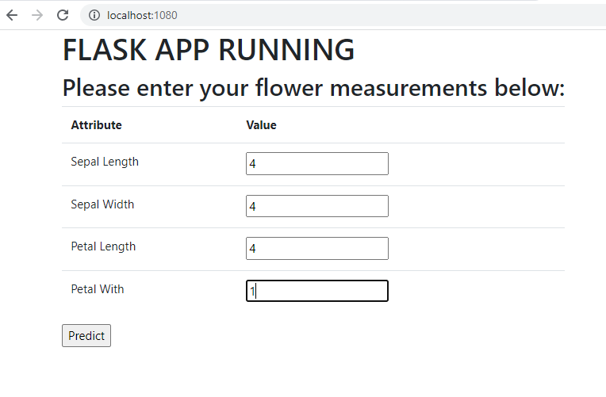

## ML Model Deployment on Minikube with Service NodePort

### Deployment yaml Fİle

- `flask-iris-deployment.yaml`
```
apiVersion: apps/v1
kind: Deployment
metadata:
  name: flask-iris-deployment
  labels:
    app: flask-iris
spec:
  replicas: 3
  selector:
    matchLabels:
      app: flask-iris
  template:
    metadata:
      labels:
        app: flask-iris
    spec:
      containers:
      - name: flask-iris
        image: erkansirin78/flask-iris-classification:2021-3
        ports:
        - containerPort: 8080
```
### Pull image inside minikube
```commandline
minikube ssh

docker pull erkansirin78/flask-iris-classification:2021-3

exit
```

### Apply Deployment 
` kubectl apply -f flask-iris-deployment.yaml `   

### Watch Deployment 
- Pods 
```
 kubectl get pods

NAME                                     READY   STATUS    RESTARTS   AGE
flask-iris-deployment-5d5f7f68c4-kmckk   1/1     Running   0          4m49s
flask-iris-deployment-5d5f7f68c4-rwbpx   1/1     Running   0          4m49s
flask-iris-deployment-5d5f7f68c4-s5dg7   1/1     Running   0          4m49s
```

### Create a NodePort Service 
` kubectl create service nodeport flask-iris --tcp=8080:8080 `

- The name of flask-iris must be same in deployment yaml file  container name  flask-iris and port number 8080 

- Check service 
```
kubectl get services

NAME         TYPE        CLUSTER-IP      EXTERNAL-IP   PORT(S)          AGE
flask-iris   NodePort    10.97.235.241   <none>        8080:31375/TCP   9s
kubernetes   ClusterIP   10.96.0.1       <none>        443/TCP          50m
```

### See your application on browser 
Open browser and enter: http://172.17.0.3:31375/

You will see the app ui. Enjoy your predictions.

### NGINX Reverse Proxy
```commandline
cat /etc/nginx/nginx.conf
user nginx;
worker_processes auto;
error_log /var/log/nginx/error.log;
pid /run/nginx.pid;

# Load dynamic modules. See /usr/share/doc/nginx/README.dynamic.
include /usr/share/nginx/modules/*.conf;

events {
    worker_connections 1024;
}


http {
server {
        listen 80;
        server_name 127.0.0.1;

        location / {
                proxy_pass http://192.168.49.2:32520;
        }
}
}

```
- Start nginx
```commandline
sudo systemctl start nginx
```

- Browser: http://localhost:1080/



---
