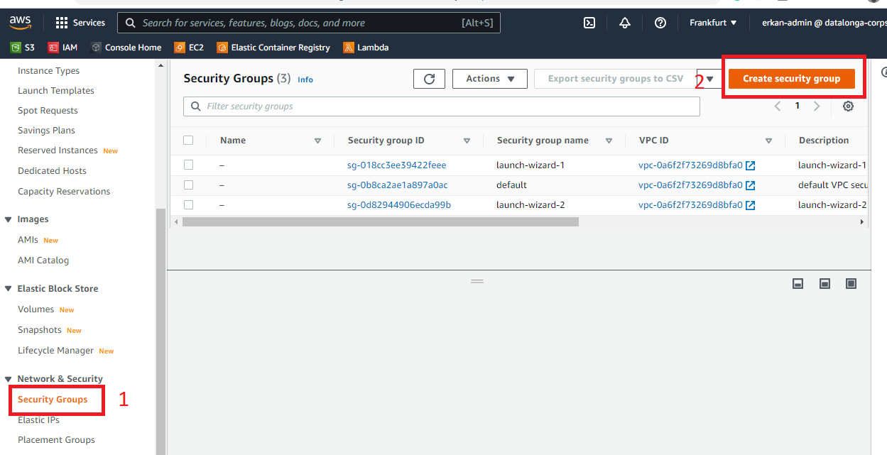
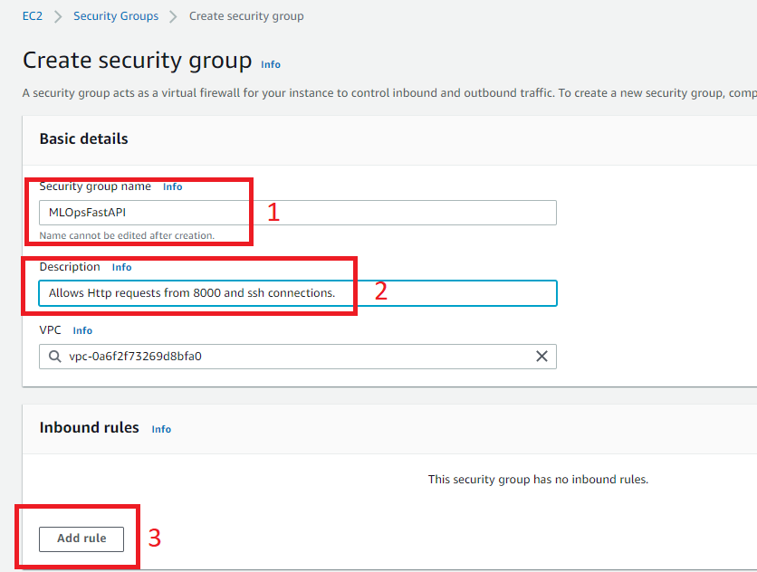
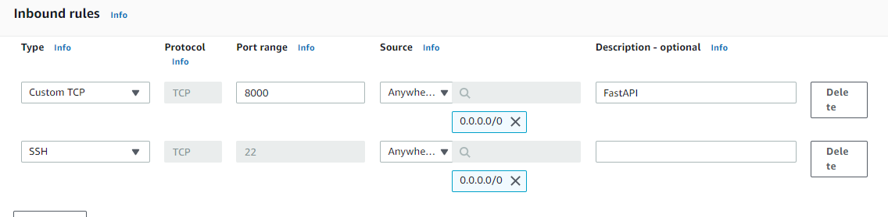

## Create an EC2 Security Group

### 1. Open AWS web console

### 2. Search EC2 Service

----------------------------------------------------------------------------

### 3. Select your region
EC2 is regional service. So you need to select region.

----------------------------------------------------------------------------
### 4. Create Security Group

-------------------------------------------

### 5. Add inbound rules

-----------------------------------

-----------------------------------

#### 6. Click Create Security Group

